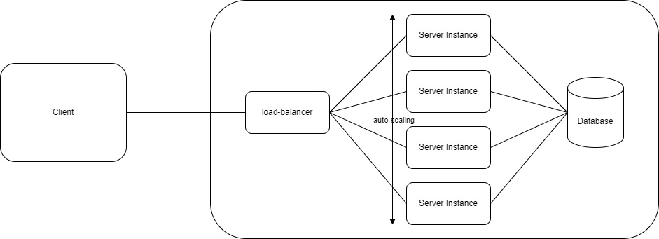

# <Your Subject>

## POC objectives
Mettre en place une infrastructure web standard (front-end et backend) dans une autre plateforme (Azure).

## Infra architecture

<Logical components, ports/protocols, cloud type.>
NoSQL database
Load balancer


## Scenario

Describe step-by-step the scenario. Write it using this format (BDD style).

### STEP 01
```
//given -> starting context

//when -> event to produce

//then - > expected result
```

## Cost

<analysis of load-related costs.>

<option to reduce or adapt costs (practices, subscription)>

## Return of experience

<take a position on the poc that has been produced.>

<Did it validate the announced objectives?>
