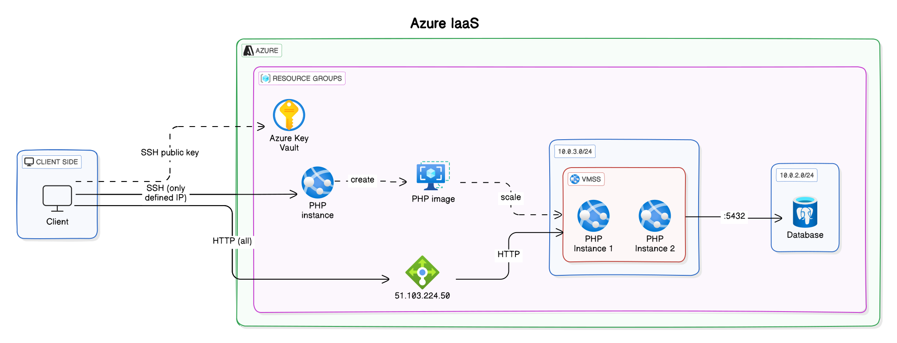

# Azure
You can access the application here : http://51.103.224.50/

## POC objectives

Mettre en place une infrastructure web standard (front-end et backend) dans une autre plateforme (Azure).

## Infra architecture

- Logical components : Database, PHP instances, Load-balancer
- Ports / Protocols : HTTPS between client and server, HTTP inside
- Cloud type : IaaS

## Scenario

Describe step-by-step the scenario. Write it using this format (BDD style).

### STEP 01

- **Given** : Idée de site web
- **When** : Développement d'un site Web en PHP
- **Then** : 1 Simple instance statique en PHP accessible depuis le web

### STEP 02

- **Given** : Instance stateful
- **When** : Mise en place d'une database afin de rendre l'instance stateless et que seul la database soit stateful
- **Then** : 1 Simple instance en PHP accessible depuis le web avec les données stockées hors de l'instance

### STEP 03

- **Given** : Instance seul susceptible d'être sur-chargée
- **When** : Mise en place d'un load balancer permettant la variation des instances disponibles
- **Then** : Infrastructure qui gère automatiquement les ressources allouées afin que le tout fonctionne avec des performances raisonnables

### STEP 04

- **Given** : Infrastructure complète accessible depuis internet
- **When** : Stress test de l'infra afin de vérifier la bonne élasticité et qu'on ne se retrouve ni en manque de ressources, ni en surplus (pour ne pas sûr-payer)
- **Then** : Infrastructure **fine tuned** pour l'utilisation désirée

## Cost

<analysis of load-related costs.>

- Load-balancer (lui-même + instances qu'il gère)
  - Instance (nombre et puissance)
- Database
- Régions
- Adresse IP publique

<option to reduce or adapt costs (practices, subscription)>

- Choisir des régions moins chères
- Puissance d'instance adapté (Petit site web donc pas besoin de grandes performances)
- Fine-tune le load-balancer afin de ne pas sur-réagir à la demande
- Utilisation de spot instances dans le cas où un calcul gourmand n'est pas immédiatement nécessaire

## Return of experience

En conclusion, nous avons mené à bien notre proof of concept (POC) en testant une grande variété de fonctionnalités, répondant ainsi aux attentes initiales du projet. Grâce à une collaboration efficace malgré le fait que nous ne nous connaissions pas et une répartition judicieuse des tâches, nous avons pu mener à bien le workshop malgré l'ampleur du projet.

En commençant par la création d'une simple instance PHP statique, nous avons progressivement mis en place une infrastructure, comprenant une base de données externalisée et un équilibrage de charge pour gérer les variations de trafic. Cette démarche a culminé avec une infrastructure optimisée, capable de s'adapter aux besoins de ressources, grâce à des tests de stress.
